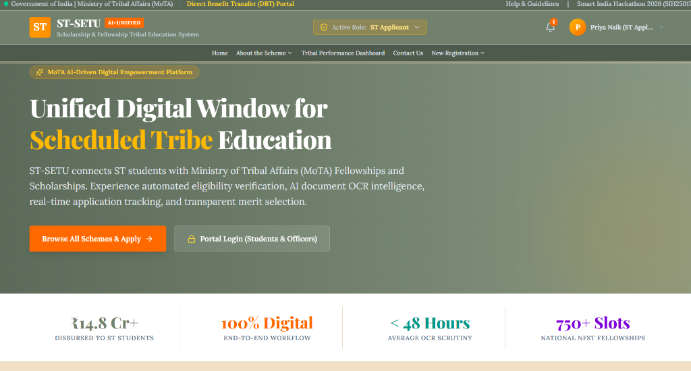
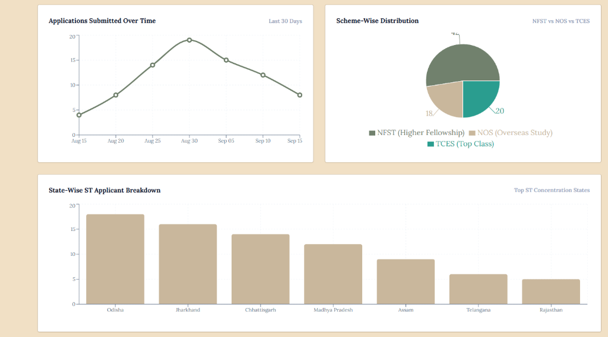
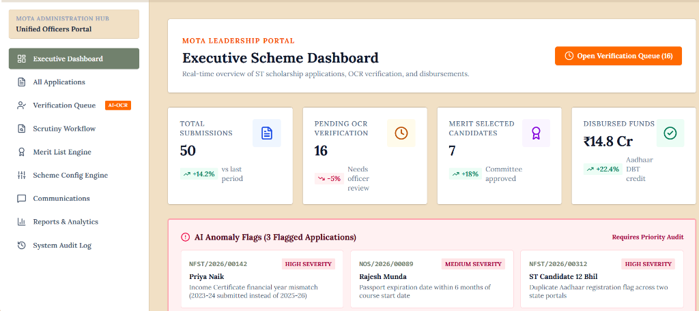
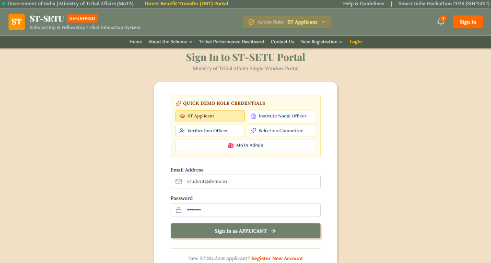
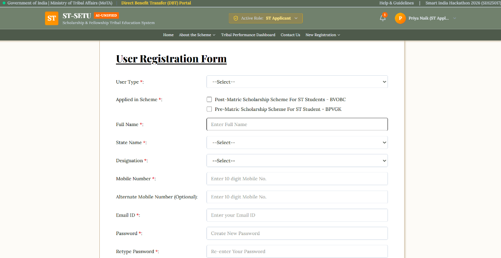

<div align="center">
  
  
  <br />
  
  <h1>🎓 ST-SETU</h1>
  <h3>Scholarship & Fellowship Tribal Education Unified Platform</h3>

  <p align="center">
    <strong>Empowering Scheduled Tribe (ST) students across India with AI-driven, transparent, and seamless access to MoTA Fellowships and Scholarships.</strong>
  </p>

  <p align="center">
    <a href="#-key-features">Key Features</a> •
    <a href="#-platform-gallery">Gallery</a> •
    <a href="#-tech-stack">Tech Stack</a> •
    <a href="#-quick-start">Quick Start</a> •
    <a href="#-architecture">Architecture</a>
  </p>
  
  <p align="center">
    
    
    
    
  </p>
</div>

---

## 🎯 About The Project

The **Ministry of Tribal Affairs (MoTA)** administers flagship scholarship schemes like the *National Fellowship for Scheduled Tribes (NFST)* and the *National Overseas Scholarship (NOS)*. 

**ST-SETU** revolutionizes this process by providing an **end-to-end digital ecosystem** that connects ST students directly with these opportunities, replacing manual scrutiny with AI-assisted verification, and ensuring real-time DBT (Direct Benefit Transfer) tracking.

---

## 📸 Platform Gallery

<table align="center">
  <tr>
    <td align="center">
      <b>Unified Digital Window</b><br/>
      
    </td>
    <td align="center">
      <b>Executive Analytics</b><br/>
      
    </td>
  </tr>
  <tr>
    <td align="center">
      <b>MoTA Leadership Dashboard</b><br/>
      
    </td>
    <td align="center">
      <b>Role-Based Authentication</b><br/>
      
    </td>
  </tr>
  <tr>
    <td align="center" colspan="2">
      <b>Streamlined Student Onboarding</b><br/>
      
    </td>
  </tr>
</table>

---

## ✨ Key Features

<details>
<summary><b>1️⃣ Unified Applicant Portal</b></summary>
<br/>
<ul>
  <li><b>Smart Scheme Browsing:</b> View eligibility criteria, required documents, and deadlines in a structured format.</li>
  <li><b>Eligibility Pre-Check:</b> Instant validation based on income, age, and academic qualifications.</li>
  <li><b>Guided Application Wizard:</b> Multi-step wizard with auto-save for personal, academic, and scheme-specific details.</li>
  <li><b>Real-Time Tracking:</b> Transparent status tracking from submission to final disbursement.</li>
</ul>
</details>

<details>
<summary><b>2️⃣ Intelligent Admin & Officer Hub</b></summary>
<br/>
<ul>
  <li><b>Real-Time Dashboards:</b> KPIs covering total applications, verification statuses, and demographic breakdowns.</li>
  <li><b>AI-Assisted Document Scrutiny:</b> Automated OCR validates data from uploaded documents against declared information, minimizing manual errors.</li>
  <li><b>Deficiency Management:</b> Streamlined workflow to raise queries and allow applicants to resubmit specific documents.</li>
  <li><b>Rule Engine:</b> Configurable eligibility criteria that administrators can modify dynamically.</li>
</ul>
</details>

---

## 🛠 Tech Stack

| Category | Technology | Purpose |
| :--- | :--- | :--- |
| **Core** | React 19, TypeScript | High-performance, strongly-typed UI components |
| **Styling** | Tailwind CSS v4 | Utility-first, highly responsive vintage-minimal design |
| **Routing** | React Router v7 | Seamless client-side navigation and route protection |
| **Icons** | Lucide React | Clean, consistent, and scalable SVG iconography |
| **Build** | Vite | Lightning-fast HMR and optimized production bundling |

---

## ⚙️ Quick Start

To run ST-SETU locally, follow these simple steps:

```bash
# 1. Clone the repository
git clone https://github.com/AryanTripathiJi/st-setu.git

# 2. Navigate into the directory
cd st-setu

# 3. Install dependencies
npm install

# 4. Start the development server
npm run dev
```

> **Developer Note:** The platform currently operates using an in-memory **API service layer** backed by browser `localStorage`. This allows the entire frontend to be demonstrated instantly without a backend server. To transition to a live backend, simply swap the fetch calls in `src/lib/apiClient.ts`!

---
<div align="center">
  <i>Built with ❤️ for the Smart India Hackathon 2026</i>
</div>
